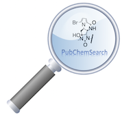

# CatSearch

A computer aided workflow for mining molecules of interest, that follow specific rules (size/weight/distances of atoms) from the PubChem library[1]

## Requirements:

0. Python v. 3.7
1. rdkit
2. numpy

## The scripts are used as follows:

a) **ParallelSearch.py** searches the library for molecules that contain two urea scaffolds, separated by four carbons.

b) To make the procedure faster the file containing the remaining molecules is split in 200 files, with **Split.py**.

c) The molecules in each of the 200 files are parallelly filtered based on chemically important parameters, such as more than two H-bond donors and a molecular weight of less than 1000 Da, with **SizeExclusion.py**.

d) **distances.py** calculates the distances between the diametrical nitrogen atoms (about 4 Å) and the distances between the diametrical hydrogen atoms (about 3 Å).

e) **ButinaClustering.py**, clusters the molecules into groups with common properties.

1.	Bolton, E. E.; Wang, Y.; Thiessen, P. A.; Bryant, S. H., PubChem: integrated platform of small molecules and biological activities. In Annual reports in computational chemistry, Elsevier2008.

